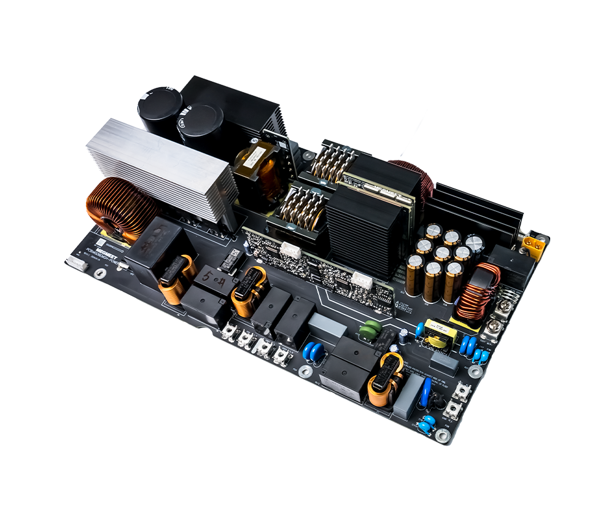
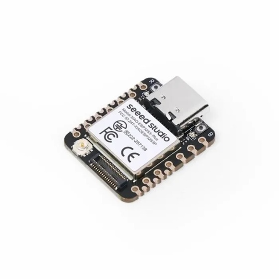

# 🔋 Batterie DIY 48V bidirectionnelle — PCM AC-coupling

Système de gestion de batterie **bidirectionnelle** (charge / décharge) couplé en **AC** sur le réseau domestique, piloté par un régulateur **PID en boucle fermée** sous [ESPHome](https://esphome.io). Le système régule automatiquement la puissance échangée avec la batterie pour maintenir la puissance active mesurée au point d'injection (compteur) proche de **0 W** — c'est-à-dire consommer le surplus solaire pour charger, et puiser dans la batterie pour couvrir les pics de consommation.

C'est en somme l'équivalent **DIY** (fait maison, open source, personnalisable) des batteries de stockage commerciales couplées AC type **Zendure SolarFlow**, **Anker SOLIX**, **EcoFlow** ou **Jackery** — avec l'avantage de pouvoir ajuster finement la régulation, le matériel et le logiciel à son propre usage.

La boucle de régulation est **très rapide**, en particulier lorsque l'option **feed-forward** est activée : un appel de charge brutal est absorbé en quelques secondes seulement. À titre d'exemple, une charge de **2000W peut être complètement compensée en 2 à 3 secondes**.

Le système peut délivrer jusqu'à **3600W en charge comme en décharge**, et dispose d'une **sortie offgrid/backup** permettant d'alimenter des charges critiques en cas de coupure secteur. ⚠️ Cette sortie offgrid nécessite une attention particulière au **régime de neutre (TT/TN)** et aux organes de protection associés (disjoncteur différentiel, commutation de neutre le cas échéant) — une intervention par une personne compétente en électricité est indispensable pour ce point précis.

Le contrôleur principal est un **ESP32-S3**, flashé avec un firmware **[ESPHome](https://esphome.io) 100% open source** — aucune dépendance à un cloud propriétaire, aucune télémétrie imposée : tout le code de régulation est visible, modifiable et auditable.

Associé à n'importe quelle batterie DIY LFP de **16 kWh**, le coût total du système avoisine les **2100 €**.

Ce dépôt documente la **version 2** du projet, construite autour d'un **PCM (Power Conversion Module) 3600W/48V** piloté par CAN bus (MCP2515), en remplacement du couple R48/HMS de la V1.

---

## 📐 Vue d'ensemble du système

```
┌─────────────────┐        ┌──────────────────────────────┐        ┌──────────────┐
│  Compteur        │  ──▶   │   ESP32-S3 (XIAO)              │  ──▶   │  PCM 3600W    │
│  d'énergie        │        │   • Lecture puissance active  │  CAN   │  bidirection- │
│  (JSY1039 /       │        │   • Régulateur PID (dualpidpcm)│        │  nel 48V      │
│  Shelly Pro 3EM)   │        │   • Pilotage CAN (MCP2515)     │        │              │
└─────────────────┘        └──────────────────────────────┘        └───────┬──────┘
                                       │                                    │
                                       │ Modbus RTU (RS485)                 │ DC 48V
                                       ▼                                    ▼
                              ┌──────────────────┐                ┌─────────────────┐
                              │  BMS JK-PB-BMS     │◀──────────────│  Batterie LFP    │
                              │  (tension batterie) │                │  51.2V           │
                              └──────────────────┘                └─────────────────┘
```

Le composant ESPHome custom [`dualpidpcm`](./components/dualpidpcm) calcule en continu l'erreur entre la puissance active mesurée et la consigne (0 W), et pilote le PCM via CAN bus pour charger ou décharger la batterie en conséquence, avec :
- une **hystérésis à deux seuils** (arrêt / redémarrage) par direction, pour éviter le cyclage rapide du relais interne du PCM ;
- une prise en compte de **l'autoconsommation à vide** du convertisseur en décharge ;
- un mode **feed-forward** (saut de consigne calibré) pour réagir rapidement aux grosses variations de charge ;
- une bascule directe charge ↔ décharge sans coupure de l'alimentation générale du PCM quand c'est possible.

---

## 🎥 Démonstration

📺 [La batterie bidirectionnelle V2 en fonctionnement](https://youtu.be/oHbPmVrNmeo)

---

## 📷 Aperçu photo

### PCM 3600W/48V bidirectionnel

*[Voir la page produit ↗](https://french.alibaba.com/product-detail/Industrial-Power-Inverter-PCB-Board-AC-1601732066501.html)*

### XIAO ESP32-S3 Plus

*[Voir la page produit ↗](https://www.gotronic.fr/art-carte-xiao-esp32s3-plus-47626.htm)*

### XIAO SX1262 (module LoRa)

*[Voir la page produit ↗](https://www.gotronic.fr/art-shield-xiao-wio-sx1262-47632.htm)*

### PCB de contrôle V1.3 (custom)

*Photo à ajouter — voir le [fichier Gerber](gerber/Gerber_LoRa_PCB_LoRa-mix_2026-05-16_V1_3.zip) en attendant.*

---

## 🧩 Les trois variantes de communication

Le projet propose **trois chaînes de mesure** différentes selon le compteur d'énergie utilisé et le lien de communication disponible. Les trois partagent la même base (BMS, PCM, régulateur PID) et ne diffèrent que par la façon dont la puissance active est remontée au contrôleur.

| Variante | Fichier YAML | Compteur | Liaison | Notes |
|---|---|---|---|---|
| **LoRa** | [`bd_pcm_lora.yaml`](code/bd_pcm_lora.yaml) | JSY1039 | LoRa (SX1262, 868 MHz) via `packet_transport` | Le compteur est déporté (ex: sur le tableau électrique), la batterie reçoit la mesure sans fil. Nécessite une clé de chiffrement partagée (`encryption_key`). |
| **Modbus TCP / WiFi** | [`bd_pcm_shellypro3em.yaml`](code/bd_pcm_shellypro3em.yaml) | Shelly Pro 3EM | Modbus TCP over WiFi (composant externe `esphome_tcp`) | Lit la puissance active sur une phase au choix (sélecteur `phase_select`, p1/p2/p3) exposée par le Shelly. Pas de câblage RS485 nécessaire. |
| **Modbus RTU direct** | [`bd_pcm_jsy1039.yaml`](code/bd_pcm_jsy1039.yaml) | JSY1039 | Modbus RTU sur RS485, câblage direct | Le compteur est câblé en direct sur le même bus RS485 que le BMS (adresses Modbus distinctes). Configuration la plus simple, sans dépendance réseau. |

Les trois fichiers réutilisent les mêmes **packages** ESPHome (chargés depuis GitHub) :

| Package | Rôle | Source |
|---|---|---|
| `bms` | Lecture BMS JK-PB-BMS (tension batterie, cellules, etc.) | [`pvbrain2/bms/jikong/device_jkpbbms.yaml`](https://github.com/SeByDocKy/pvbrain2) |
| `pcm` | Pilotage du PCM via CAN bus (MCP2515) | [`code/device_mcp2515_pcm.yaml`](code/device_mcp2515_pcm.yaml) |
| `dualpidpcm` | Régulateur PID bidirectionnel (composant custom) | [`code/device_dualpidpcm.yaml`](code/device_dualpidpcm.yaml) |
| `powermeter` *(variante RTU directe uniquement)* | Lecture JSY1039 en local | [`code/device_jsy1039.yaml`](code/device_jsy1039.yaml) |

---

## 🛠️ Matériel (BOM)

### Carte électronique

- **PCM 3600W / 48V bidirectionnel** (seul modèle trouvé en 48V à ce jour) — [lien fournisseur](https://french.alibaba.com/product-detail/Industrial-Power-Inverter-PCB-Board-AC-1601732066501.html)
- **1× XIAO ESP32-S3 Plus** — [Gotronic](https://www.gotronic.fr/art-carte-xiao-esp32s3-plus-47626.htm)
- **1× XIAO SX1262 (module LoRa)** *(variante LoRa uniquement)* — [Gotronic](https://www.gotronic.fr/art-shield-xiao-wio-sx1262-47632.htm)
- **1× XIAO ESP32-S3 Meshtastic (ESP32-S3 + LoRa SX1262)** *(alternative intégrée pour la variante LoRa)* — [Gotronic](https://www.gotronic.fr/art-xiao-esp32s3-mash-lora-40055.htm)
- **1× contrôleur CAN MCP2515** — [AliExpress](https://fr.aliexpress.com/item/1005006135600010.html)
  *ou en alternative :*
- **1x contrôleur CAN MCP2518FD** - [Reichelt](https://www.reichelt.com/de/en/shop/product/developer_boards_-_can_module_mcp2518-376524)  
- **1× convertisseur high-speed dual** — [AliExpress](https://fr.aliexpress.com/item/1005006063419651.html)

### Protections & connectique

- **3× fusibles + 3× porte-fusibles** — [porte-fusibles](https://fr.aliexpress.com/item/1005009482930402.html) / [fusibles](https://fr.aliexpress.com/item/1005007451125243.html)
- **3× bornier 2 points** — [AliExpress](https://fr.aliexpress.com/item/1005010629723401.html)
- **Connecteurs JST 2.54mm mâle/femelle** — [AliExpress](https://fr.aliexpress.com/item/4000873858801.html)
- **Connecteur 2.54mm long** — [AliExpress](https://fr.aliexpress.com/item/1005006783391171.html)
- **1× sectionneur 600A** (protection DC batterie) — [AliExpress](https://fr.aliexpress.com/item/1005010347499706.html)
- **1× connecteur RJ45** — [AliExpress](https://fr.aliexpress.com/item/1005009200192593.html)

### Mesure & alimentation

- **1× compteur d'énergie JSY-MK-1039** — [AliExpress](https://fr.aliexpress.com/item/1005007956840686.html)
- **1× transformateur 230V → 5V** (alimentation logique) — [AliExpress](https://fr.aliexpress.com/item/1005010271595546.html)

> ⚠️ Le Shelly Pro 3EM (variante Modbus TCP) n'est pas listé ici — c'est un produit du commerce, disponible chez la plupart des revendeurs d'équipement domotique/électrique.

---

## 🖨️ PCB

Le PCB **V1.3** (carte de contrôle intégrant l'ESP32, le lien LoRa et l'interface CAN) est disponible au format Gerber, prêt à commander chez un fabricant de PCB (JLCPCB, PCBWay, etc.) :

📦 [`Gerber_LoRa_PCB_LoRa-mix_2026-05-16_V1_3.zip`](gerber/Gerber_LoRa_PCB_LoRa-mix_2026-05-16_V1_3.zip)

---

## ⚙️ Installation

### 0. Sans installer ESPHome (via Google Colab)

Vous n'avez pas besoin d'installer le framework ESPHome sur votre machine : il est possible de compiler et flasher le firmware directement depuis le navigateur via Google Colab. La méthode est expliquée en vidéo ici :

📺 [Compiler et flasher ESPHome sans installation, via Google Colab](https://youtu.be/cs016LD6Wy8)

### 1. Pré-requis

- [ESPHome](https://esphome.io/guides/getting_started_command_line.html) ≥ 2025.10 (2026.7 recommandé pour les variantes LoRa/RTU)
- Un fichier `secrets.yaml` à la racine du projet contenant a minima :

```yaml
wifi_ssid: "MonReseauWiFi"
wifi_password: "MotDePasseWiFi"
ap_password: "MotDePasseSecours"
encryption_key: "..."   # uniquement pour la variante LoRa (packet_transport)
```

### 2. Choix de la variante

Sélectionnez le fichier YAML correspondant à votre configuration matérielle :

```bash
# Variante LoRa
esphome run code/bd_pcm_lora.yaml

# Variante Modbus TCP (Shelly Pro 3EM)
esphome run code/bd_pcm_shellypro3em.yaml

# Variante Modbus RTU directe (JSY1039 câblé)
esphome run code/bd_pcm_jsy1039.yaml
```

### 3. Paramètres à adapter

Chaque fichier expose des `substitutions` en tête de fichier à ajuster selon votre installation, notamment :

- `bms_modbus_address` / `powermeter_modbus_address` / `shelly_modbus_address` : adresses Modbus des équipements sur le bus
- `shelly_ip_address` / `shelly_ip_port` *(variante TCP)* : adresse IP du Shelly Pro 3EM
- `pcm_min_charging`, `pcm_max_charging`, `pcm_min_discharging`, `pcm_max_discharging` : bornes de courant (A) transmises au PCM
- `dualpidpcm_current_min_charging` / `dualpidpcm_current_min_discharging` : courants minimum réellement exploitables par le PCM, utilisés par le régulateur pour ses seuils d'hystérésis

---

## 🎛️ Le régulateur PID (`dualpidpcm`)

Le cœur de la régulation est le composant custom `dualpidpcm`. Une fois flashé, il expose dans Home Assistant (ou l'interface web ESPHome) :

**Switches**
- `activation` — active/désactive la régulation (⚠️ l'état est mémorisé en flash, persiste après reboot)
- `feedforward` — active le saut de consigne calibré sur les grosses variations de charge
- `allow_charging` / `allow_discharging` — autorisent/interdisent indépendamment la charge et la décharge
- `reverse`, `pid_mode`, `manual_override` — options avancées

**Numbers (réglables à la volée)**
- `setpoint` — consigne de puissance active (typiquement 0 W)
- `kp`, `ki`, `kd` — gains du PID
- `self_consumption` / `discharge_self_consumption` — autoconsommation à vide du convertisseur en décharge (W)
- `delta_idle_charging` / `delta_idle_discharging` — largeur de l'hystérésis anti-cyclage entre l'arrêt et le redémarrage de chaque direction (W)
- `feedforward_threshold` — seuil de déclenchement du saut feed-forward (W)
- `starting_battery_voltage` / `stopping_battery_voltage` — hystérésis de protection sous-tension batterie
- `output_min_charging`, `output_max_charging`, `output_min_discharging`, `output_max_discharging` — bornes de sortie par direction (%)

**Capteurs de diagnostic**
- `pid_error`, `pid_output`, `pid_deadband`, `pid_mode` — pour suivre la régulation en temps réel (par exemple via Grafana/InfluxDB ou l'historique Home Assistant)

---

## ⚠️ Avertissements

- Ce projet manipule du **230V AC** et de la **haute tension DC batterie (48-58V)** — toute intervention doit être réalisée par une personne compétente en électricité, hors tension, avec les protections adéquates (fusibles, sectionneur).
- La **sortie offgrid/backup** implique une vigilance particulière sur le **régime de neutre (TT/TN)** et les organes de sécurité associés (différentiel, commutation de neutre) — à faire réaliser ou vérifier par un professionnel.
- Ce dépôt est fourni **tel quel**, sans garantie. L'auteur ne peut être tenu responsable des dommages matériels ou corporels liés à la réalisation de ce projet.
- Vérifiez la compatibilité de votre BMS et de votre batterie LFP avec les plages de tension configurées avant toute mise en service.

---

## 📄 Licence

Ce projet est distribué sous licence **MIT**.

```
MIT License

Copyright (c) 2026 SeByDocKy

Permission is hereby granted, free of charge, to any person obtaining a copy
of this software and associated documentation files (the "Software"), to deal
in the Software without restriction, including without limitation the rights
to use, copy, modify, merge, publish, distribute, sublicense, and/or sell
copies of the Software, and to permit persons to whom the Software is
furnished to do so, subject to the following conditions:

The above copyright notice and this permission notice shall be included in all
copies or substantial portions of the Software.

THE SOFTWARE IS PROVIDED "AS IS", WITHOUT WARRANTY OF ANY KIND, EXPRESS OR
IMPLIED, INCLUDING BUT NOT LIMITED TO THE WARRANTIES OF MERCHANTABILITY,
FITNESS FOR A PARTICULAR PURPOSE AND NONINFRINGEMENT. IN NO EVENT SHALL THE
AUTHORS OR COPYRIGHT HOLDERS BE LIABLE FOR ANY CLAIM, DAMAGES OR OTHER
LIABILITY, WHETHER IN AN ACTION OF CONTRACT, TORT OR OTHERWISE, ARISING FROM,
OUT OF OR IN CONNECTION WITH THE SOFTWARE OR THE USE OR OTHER DEALINGS IN THE
SOFTWARE.
```

Le texte complet est également disponible dans le fichier [LICENSE](LICENSE) du dépôt.

## 👤 Auteur

[SeByDocKy](https://github.com/SeByDocKy) — [dépôt myESPhome](https://github.com/SeByDocKy/myESPhome)

## 🔗 Liens utiles

- [ESPHome — documentation officielle](https://esphome.io)
- [pvbrain2 — packages BMS](https://github.com/SeByDocKy/pvbrain2)
- [esphome_tcp — composant Modbus TCP externe](https://github.com/creepystefan/esphome_tcp)
